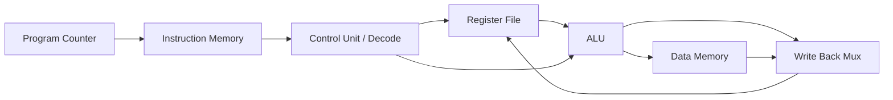

# RISC-V Processor Simulation (CAO Project)

This project implements a simple 32-bit RISC-V style processor in Verilog using a classic 5-stage pipeline. The design is intended for Computer Architecture (CAO) coursework and demonstrates instruction flow from fetch to write-back.

## Processor Overview

The processor is organized into the following stages:

1. **Instruction Fetch (IF)**
   - Uses the Program Counter (PC) to fetch instructions from instruction memory.
   - PC increments by 4 for each next instruction.

2. **Instruction Decode (ID)**
   - Decodes opcode, source/destination registers, and immediate values.
   - Reads operands from the register file.
   - Generates control signals for later stages.

3. **Execute (EX)**
   - Performs ALU operations (ADD, SUB, AND, OR).
   - Computes effective address for load/store instructions.

4. **Memory Access (MEM)**
   - Accesses data memory for LOAD and STORE operations.

5. **Write Back (WB)**
   - Writes ALU result or memory read data back to destination register.

## Main Components

- **Program Counter**: Holds current instruction address.
- **Instruction Memory**: Stores sample instruction program.
- **Control Unit**: Implemented in decode logic inside `cpu_top.v`.
- **Register File**: 32 registers (`x0` to `x31`), with `x0 = 0`.
- **ALU**: Supports ADD, SUB, AND, OR.
- **Data Memory**: Simple array-based memory for load/store.
- **Pipeline Registers**: IF/ID, ID/EX, EX/MEM, MEM/WB.

## Folder Structure

```text
CAO_PROJECT_RISCV
│
├── src        (Verilog source files)
├── sim        (testbench / simulation files)
├── sim_out    (simulation outputs)
├── README.md
```

Notes:
- `src/` contains all processor modules.
- `sim/` contains testbench files.
- `sim_out` is generated after compilation (Icarus output artifact).

## Tools Used

- Verilog HDL
- Icarus Verilog (`iverilog`, `vvp`)
- ModelSim (optional)
- Vivado Simulator (optional)

## How To Compile And Run

From the project root directory:

```bash
iverilog -g2012 -o sim_out src/*.v sim/testbench.v
vvp sim_out
```

You should see cycle-by-cycle output for PC, selected registers, and memory values.

## Suggested Architecture Diagram

Use the following block diagram in your report/slides:



This diagram includes the required blocks:
- Program Counter
- Instruction Memory
- Control Unit
- Register File
- ALU
- Data Memory

## Author

**Shri Shailesh**  
VIT Vellore
